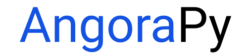

<br />
<br />

<p align="center"></p>
<h3> <p align="center"> Anthropomorphic Goal-Oriented Robotic Control for Neuroscientific Modeling </p> </h3>

<br />
   
**AngoraPy** is an open source modeling library for [goal-oriented research](https://pubmed.ncbi.nlm.nih.gov/26906502/) in **neuroscience**. It provides a simple interface to train deep neural network models of the human brain on various, customizable, sensorimotor tasks, using reinforcement learning. It thereby empowers goal-driven modeling to surpass the sensory domain and enter that of sensori_motor_ control, closing the perception-action loop. 

**AngoraPy** is designed to require no deeper understanding of reinforcement learning. It employs state-of-the-art machine learning techniques, optimized for distributed computation scaling from local workstations to high-performance computing clusters. We aim to hide as much of this under the hood of an intuitive, high-level API but preserve the option for customizing most aspects of the pipeline.

This library is developed as part of the [Human Brain Project](https://www.humanbrainproject.eu/) at [CCN Maastricht](https://www.ccnmaastricht.com/). It is an effort to build software by neuroscientists, for neuroscientists. If you have suggestions, requests or questions, feel free to [open an issue](https://github.com/ccnmaastricht/angorapy/issues/new/choose).


## 📥 Installation

AngoraPy is available on PyPI. 

```bash
pip install angorapy
```

### From source
Alternatively, you can download this repository or the source code of any previous release or branch and install from source, using pip.

```bash
pip install -e .
```

This way, if you make changes to the source code, these will be recognized in the installation (without the need to reinstall).

### Docker
Alternatively, you can install AngoraPy and all its dependencies in a docker container using the Dockerfile provided in this repository (/docker/Dockerfile). To this end, download the repository and build the docker image from the /docker directory:

```bash
sudo docker build -t angorapy:master https://github.com/ccnmaastricht/angorapy.git#master -f - < Dockerfile
```

To install different versions, replace `#master` in the source by the tag/branch of the respective version you want to install.

## 🚀 Getting Started
The scripts `train.py`, `evaluate.py` and `observe.py` provide ready-made scripts for training and evaluating an agent in any environment. With `pretrain.py`, it is possible to pretrain the visual component. `benchmark.py` provides functionality for training a batch of agents possibly using different configs for comparison of strategies.

### Training an Agent
The `train.py` commandline interface provides a convenient entry-point for running all sorts of experiments using the builtin models and environments in angorapy. You can train an agent on any environment with optional hyperparameters. Additionally, a monitor will be automatically linked to the training of the agent. For more detail consult the <a href="monitor/README.md">README on monitoring</a>.

Base usage of `train.py` is as follows:

    python train.py ENV --architecture MODEL
    
For instance, training `LunarLanderContinuous-v2` using the `deeper` architecture is possible by running:

    python train.py LunarLanderContinuous-v2 --architecture deeper
    
For more advanced options like custom hyperparameters, consult

    python train.py -h


### Evaluating and Observing an Agent
There are two more entry points for evaluating and observing an agent: `evaluate.py` and `observe.py`. General usage is as follows

    python evaluate.py ID

Where ID is the agent's ID given when its created (`train.py` prints this outt, in custom scripts get it with `agent.agent_id`).

### Writing a Training Script
To train agents with custom models, environments, etc. you write your own script. The following is a minimal example:

```python
from angorapy.common.wrappers import make_env
from angorapy.models import get_model_builder
from angorapy.agent.ppo_agent import PPOAgent

env = make_env("LunarLanderContinuous-v2")
model_builder = get_model_builder("simple", "ffn")
agent = PPOAgent(model_builder, env)
agent.drill(100, 10, 512)
```

For more details, consult the [examples](examples).

## 🎓 Documentation
Detailed documentation of AngoraPy is provided in the READMEs of most subpackages. Additionally, we provide [examples and tutorials](examples) that get you started with writing your own scripts using AngoraPy. For further readings on specific modules, consult the following READMEs: 

 - [Agent](angorapy/agent) [WIP]
 - [Environments](angorapy/environments)
 - [Models](angorapy/models)
 - [Analysis](angorapy/analysis)
 - [Monitoring](angorapy/monitoring)

If you are missing a documentation for a specific part of AngoraPy, feel free to open an issue and we will do our best to add it.

## 🔀 Distributed Computation
PPO is an asynchronous algorithm, allowing multiple parallel workers to generate experience independently. 
We allow parallel gathering and optimization through MPI. Agents will automatically distribute their workers evenly on 
the available CPU cores, while optimization is distributed over all available GPUs. If no GPUs are available, all CPUs 
share the task of optimizing.

Distribution is possible locally on your workstation and on HPC sites. 

### 💻 Local Distributed Computing with MPI
To use MPI locally, you need to have a running MPI implementation, e.g. Open MPI 4 on Ubuntu.
To execute `train.py` via MPI, run

```bash
mpirun -np 12 --use-hwthread-cpus python3 train.py ...
```

where, in this example, 12 is the number of locally available CPU threads and `--use-hwthread-cpus`
makes available threads (as opposed to only cores). Usage of `train.py` is as described previously.

### :cloud: Distributed Training on SLURM-based HPC clusters
*Please note that the following is optimized and tested on the specific cluster we use, but should extend to at least 
any SLURM based setup.*

On any SLURM-based HPC cluster you may submit your job with sbatch usising the following script template:

```bash
#!/bin/bash -l
#SBATCH --job-name="angorapy"
#SBATCH --account=xxx
#SBATCH --time=24:00:00
#SBATCH --nodes=32
#SBATCH --ntasks-per-core=1
#SBATCH --ntasks-per-node=12
#SBATCH --cpus-per-task=1
#SBATCH --partition=normal
#SBATCH --constraint=gpu&startx
#SBATCH --hint=nomultithread

export OMP_NUM_THREADS=$SLURM_CPUS_PER_TASK
export CRAY_CUDA_MPS=1

# load virtual environment
source ${HOME}/robovenv/bin/activate

export DISPLAY=:0
srun python3 -u train.py ...
```

The number of parallel workers will equal the number of nodes times the number of CPUs per node 
(32 x 12 = 384 in the template above).

## 🔗 Citing AngoraPy

If you use AngoraPy for your research, please cite us as follows

    Weidler, T., & Senden, M. (2020). AngoraPy: Anthropomorphic Goal-Oriented Robotic Control for Neuroscientific Modeling [Computer software]

Or using bibtex

    @software{angorapy2020,
        author = {Weidler, Tonio and Senden, Mario},
        month = {3},
        title = {{AngoraPy: Anthropomorphic Goal-Oriented Robotic Control for Neuroscientific Modeling}},
        year = {2020}
    }
